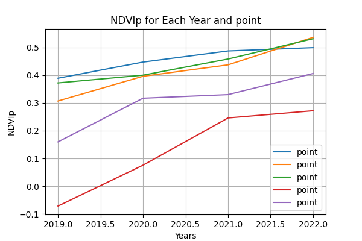
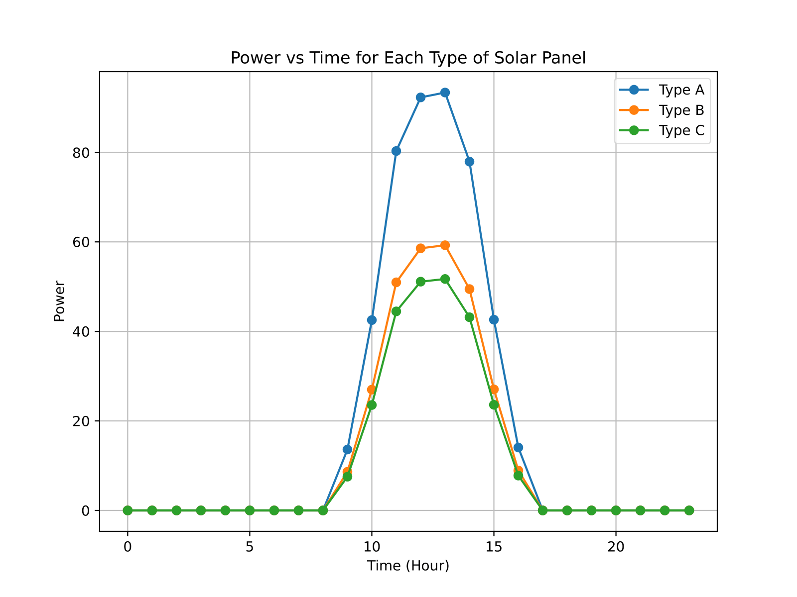

# 🧮 Introduction to Computer Programming  
**University of Bristol — EMAT10007 (2023)**  

Python coursework applying computational modelling to environmental and renewable energy systems.  
The project demonstrates modular programming, data analysis, and plotting using real-world datasets.

---

## 🌿 Part 1 – Vegetation Health (NDVI Analysis)

**Goal:** Calculate and visualise vegetation health using satellite red and near-infrared reflectance data.

**Key Features**
- Computed the Normalised Difference Vegetation Index (NDVI).  
- Categorised vegetation health based on NDVI ranges.  
- Calculated RMSE between measured and predicted NDVI values.  
- Visualised NDVI trends across multiple years.  

**Files**
1. `Ex1.py` — main Python code implementing NDVI analysis  
2. `Report for EX1.py.docx` — documentation explaining methods and results  
3. `ex1_question5.png` — output figure showing NDVI trends  

### 📊 Example Output  

---

## ⚡ Part 2 – Renewable Energy Simulation

**Goal:** Model solar and wind power generation to evaluate energy availability throughout the year.

**Key Features**
- Simulated solar panel performance using real intensity data.  
- Compared three panel types by efficiency and design.  
- Modelled wind turbine rotation and power output.  
- Plotted monthly average renewable power generation.  

**Files**
1. `Ex3.py` — Python code implementing solar and wind models  
2. `Report for EX3.py.docx` — written report detailing modelling and results  
3. `ex3_question1.pdf` — generated figure showing early simulation results  
4. `ex3_question3.pdf` — final combined renewable output figure  

### ⚙️ Example Outputs

---

### 🧠 Skills & Tools
- Python • Matplotlib • CSV • Math  
- Loops, Functions, Conditional Structures  
- Data Visualisation and Report Writing  

---
